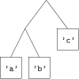

=========================
Types
=========================

Plan
=========================

.. Typage statique
   ---------------------------      
      
   - Chaque valeur à un type associé.
   - Les types sont vérifiés à la compilation.

   .. figure:: figs/type.svg
      :width: 80%
      :alt: types et typage
      :align: center

.. Polymorphisme
   ---------------------------

   Les types composés sont *polymorphes* quand ils décrivent une famille de types :

   ``[a]`` désigne la famille des listes d'éléments de type ``a``
   (le :math:`(\forall a)` est implicite).  

   Exemple : ``[1,2,3], ['a','b','c'], ["azerty", "qwerty"]`` sont de type ``[a]``, mais pas ``[2,'b']``. 

Déclarations
-------------------

On a vu pour l'instant deux sortes de déclarations :

- *equation*
- *type signature*

On va maintenant en voir d'autres : 
  
- ``data`` declaration (créer un type)
- ``type`` declaration (créer un synonyme de type)
- ``newtype`` declaration (créer un type à partir d'un autre)

- ``class`` declaration (créer un groupe de type)
- ``instance`` declaration (déclarer un type comme appartenant à un groupe donné) 
    
 
Type défini par le développeur
=================================

Déclaration ``data``
----------------------------------

En Haskell, on peut définir nos propres types par des déclarations ``data`` :

.. code-block:: haskell

   data constructeurDeType = constructeurDeValeur

Il est possible de définir plusieurs sortes de type de cette façon :
   
- type polymorphe
- type énuméré
- type récursif

  
Type polymorphe
-----------------

Un *type polymorphe* est composé d'au moins une famille de type.

.. code-block:: haskell

   data Point a = Pt a a

Par exemple, à partir de tout type ``a``, le constructeur de type ``Point``
définit ``Point a``, le type des points cartésiens ayant ``a`` comme coordonnées. 

Le constructeur de valeur ``Pt :: a -> a -> Point a`` est une manière d'obtenir
des valeurs de type ``Point a``. Par exemple, ``Pt 2.0 3.0`` est le point :math:`(2,3)`.

Avertissement
-----------------

Les constructeurs de type comme ``Point`` et les constructeurs de valeurs comme ``Pt``
se trouvent dans des espaces de noms séparés. Il est donc possible de donner le même nom
aux deux constructeurs, afin de rendre plus évident le lien entre un type et le constructeur
de valeur associé. 

.. literalinclude:: code/shape.hs
   :language: haskell
   :lines: 1

Type énuméré
-----------------

On utilise le symbole ``|`` pour faire des unions (disjointes)
dans les ensembles de valeur représentant un type : 

.. .. code-block:: haskell

      data Day = Monday | Tuesday | Wednesday | Thursday | Friday | Saturday | Sunday

.. literalinclude:: code/shape.hs
   :language: haskell
   :lines: 3-4

Autrement dit, une valeur de type ``Shape`` est soit un cercle
(défini par un point de type ``Point Float`` et un rayon de type ``Float``),
soit un rectangle (défini par deux points de type ``Point Float``).  
	   
.. literalinclude:: code/shape.hs
   :language: haskell
   :lines: 7-12

	   
Types récursifs
----------------------   

Il est possible de se référer au type que l'on crée
dans un des constructeurs de valeurs. 

.. literalinclude:: code/tree.hs
   :language: haskell
   :lines: 1

Autrement dit, une valeur de type ``Tree a`` est un arbre binaire polymophique
dont les éléments sont soit une feuille (contenant une valeur de type ``a``),
soit un noeud interne reliant deux sous-arbres.      

.. literalinclude:: code/tree.hs
   :language: haskell
   :lines: 3-6

Liste revisitée
-------------------

``[a]`` est en fait une notation particulière pour ``[] a``, car 
``[]`` est un *constructeur de type* :
à partir du type ``a``, il crée le type ``[] a``, c'est-à-dire
une liste de ``a``. 

La définition d'une liste est récursive :

.. code-block:: haskell

   data [a] = [] | a : [a]

Une liste de ``a`` est soit une liste vide, soit une liste ayant au moins
une valeur de type ``a`` en tête de liste. 

Défi 1 : construire un arbre
---------------------------------

A l'aide des définitions précédentes,
construisez l'arbre représenté ci-dessous,
et passez-le comme argument à la fonction ``flatten`` dans GHCi. 

Défi 2 : liste imbriquée
-----------------------------------

Définissez une fonction

.. literalinclude:: code/NestedList.hs
   :language: haskell
   :lines: 3

qui aplatit une liste d'élément
pouvant contenir des listes comme élément.  

.. code-block:: none

   *Main> flatten (Elem 5)
   [5]
   *Main> flatten (List [Elem 1, List [Elem 2, List [Elem 3, Elem 4]]])
   [1,2,3,4]
   *Main> flatten (List [])
   []

	   
Défi 3 : aplatir un arbre binaire
-----------------------------------

Proposez une version plus efficace de ``flatten``
en utilisant l'opérateur ``(:)`` au lieu de l'opérateur ``(++)``. 

.. code-block:: none

   *Main> flatten (Node (Node (Leaf 1) (Leaf 2)) (Leaf 3)) 
   [1,2,3]

Astuce : comme pour :ref:`MyReverse<reversecode>`, définissez une fonction intermédiaire
qui prend en entrée l'arbre et une liste temporaire d'accumulation. 

.. code-block:: Haskell

   flatten' :: Tree a -> [a] -> [a] 

Synonymes
---------------------------------

Il est possible de définir des synonymes de types grâce à la déclaration ``type`` :

- ``type String = [Char]``
- ``type AssociationList a b = [(a,b)]``
- ``type PhoneNumber = String``  
- ``type Name = String``  
- ``type PhoneBook = [(Name,PhoneNumber)]`` 

Classe et surcharge
==========================

Polymorphisme contraint
----------------------------

Le *contexte* qui précède le type indique quelles opérations on peut effectuer avec les valeurs de type ``a``:

- ``Eq a`` (``==``, ``!=``)
- ``Ord a`` (``<``, ``<=``, ``>``, ``>=``, ``min``, ``max``)
- ``Show a`` (conversion en chaîne de caractères ``show``, ``shows``)
- ``Num a`` (opérations arithmétiques...)

Conclusion
================

Défi 1 : construire un arbre
---------------------------------

.. code-block:: none

   *Main> flatten (Node (Node (Leaf 'a') (Leaf 'b')) (Leaf 'c'))
   "abc"

Défi 2 : liste imbriquée
-----------------------------------

.. literalinclude:: code/NestedList.hs
   :language: haskell

   
Défi 3 : aplatir un arbre binaire
-----------------------------------

.. literalinclude:: code/tree2.hs
   :language: haskell
